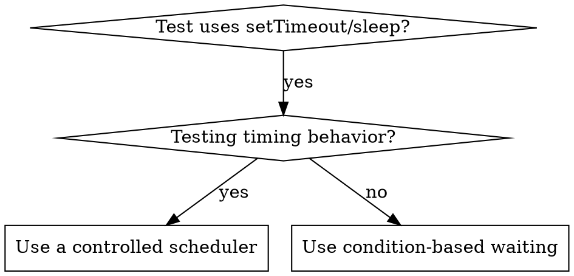

# Condition-Based Waiting

## Overview

Flaky tests often guess timing with arbitrary delays. This creates race conditions: tests pass on fast machines, fail under load or in CI.

**Core principle:** Wait for actual condition you care about, not guess how long it takes.

## When to Use



**Use when:**
- Tests have arbitrary delays (`setTimeout`, `sleep`, `time.sleep()`)
- Tests are flaky (pass sometimes, fail under load)
- Tests timeout when run in parallel
- Waiting for async operations to complete

**Don't use when:**
- For debounce or throttle contracts, use a controlled scheduler and assert behavior at the relevant time boundaries.

## Core Pattern

Prefer your framework's built-in polling assertion first — Vitest `expect.poll`, Testing Library `waitFor`, Playwright's auto-waiting, Jest fake timers. Hand-roll the loop below only when no such primitive exists (custom event bus, non-test code).

```typescript
// ❌ BEFORE: Guessing at timing
await new Promise(r => setTimeout(r, 50));
const result = getResult();
expect(result).toBeDefined();

// ✅ AFTER: Waiting for condition
await waitFor(() => getResult() !== undefined);
const result = getResult();
expect(result).toBeDefined();
```

## Quick Patterns

| Scenario | Pattern |
|----------|---------|
| Wait for event | `waitFor(() => events.find(e => e.type === 'DONE'))` |
| Wait for state | `waitFor(() => machine.state === 'ready')` |
| Wait for count | `waitFor(() => items.length >= 5)` |
| Wait for file | `waitFor(() => fs.existsSync(path))` |
| Complex condition | `waitFor(() => obj.ready && obj.value > 10)` |

## Implementation

Generic polling function:
```typescript
async function waitFor<T>(
  condition: () => T | undefined | null | false,
  description: string,
  timeoutMs = 5000
): Promise<T> {
  const startTime = Date.now();

  while (true) {
    const result = condition();
    if (result) return result;

    if (Date.now() - startTime > timeoutMs) {
      throw new Error(`Timeout waiting for ${description} after ${timeoutMs}ms`);
    }

    await new Promise(r => setTimeout(r, 10)); // Poll every 10ms
  }
}
```

## Common Mistakes

**❌ Polling too fast:** `setTimeout(check, 1)` - wastes CPU
**✅ Fix:** Choose an interval appropriate to the operation cost and response requirements.

**❌ No timeout:** Loop forever if condition never met
**✅ Fix:** Always include timeout with clear error

**❌ Stale data:** Cache state before loop
**✅ Fix:** Call getter inside loop for fresh data

## Timer intervals and output completion

Use a controlled scheduler when the contract concerns timer intervals.
Advance the scheduler to the relevant boundaries and assert the expected callbacks or state.

When the contract concerns output completion, wait for the output condition with a bounded timeout:

```typescript
await waitFor(
  () => outputs.length >= 2,
  'two output chunks',
  5000
);
```

Elapsed wall-clock time does not guarantee that scheduled callbacks have executed.
A 200 ms delay cannot prove two callbacks occurred at a 100 ms interval.
