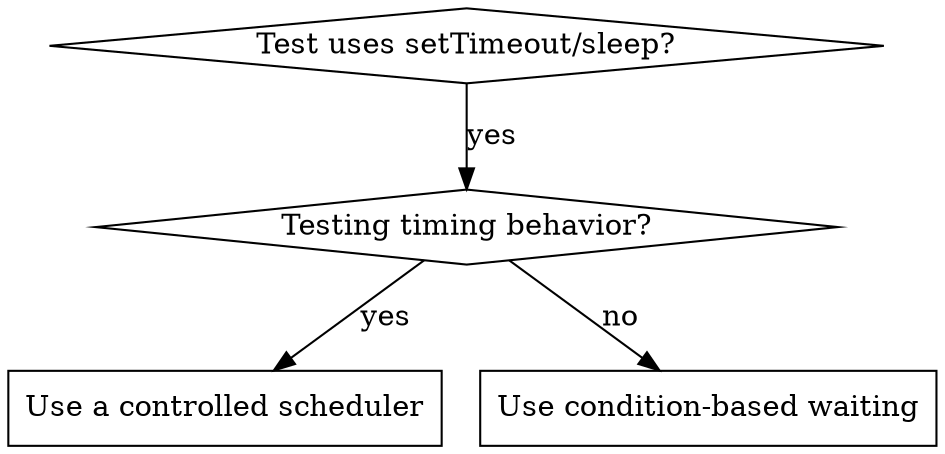

# Condition-Based Waiting

## Overview

Flaky tests often guess timing with arbitrary delays. This creates race conditions: tests pass on fast machines, fail under load or in CI.

**Core principle:** Wait for actual condition you care about, not guess how long it takes.

## When to Use



**Use when:**
- Tests have arbitrary delays (`setTimeout`, `sleep`, `time.sleep()`)
- Tests are flaky (pass sometimes, fail under load)
- Tests timeout when run in parallel
- Waiting for async operations to complete

**Don't use when:**
- For debounce or throttle contracts, use a controlled scheduler and assert behavior at the relevant time boundaries.

## Core Pattern

Prefer your framework's built-in polling assertion first — Vitest `expect.poll`, Testing Library `waitFor`, Playwright's auto-waiting, Jest fake timers. Hand-roll the loop below only when no such primitive exists (custom event bus, non-test code).

```typescript
// ❌ BEFORE: Guessing at timing
await new Promise(r => setTimeout(r, 50));
const result = getResult();
expect(result).toBeDefined();

// ✅ AFTER: Waiting for condition
const result = await waitFor(
  () => getResult(),
  value => value !== undefined,
  () => false,
  'result'
);
expect(result).toBeDefined();
```

## Quick Patterns

| Scenario | Pattern |
|----------|---------|
| Wait for event | Observe the event collection; succeed when the expected event appears. |
| Wait for state | Observe the current state; succeed on the target state and stop on a terminal failure state. |
| Wait for count | Observe the current count; succeed when it reaches the threshold. |
| Wait for file | Observe current filesystem state; succeed when the expected path exists. |
| Complex condition | Observe the owning state object; evaluate success and failure from the same fresh snapshot. |

## Implementation

Generic polling function:
```typescript
async function waitFor<T>(
  observe: () => T,
  isReady: (observation: T) => boolean,
  isFailed: (observation: T) => boolean,
  description: string,
  timeoutMs = 5000
): Promise<T> {
  const startTime = Date.now();
  let lastObservation: T;

  while (true) {
    lastObservation = observe();
    if (isReady(lastObservation)) return lastObservation;
    if (isFailed(lastObservation)) {
      throw new Error(`${description} failed: ${JSON.stringify(lastObservation)}`);
    }

    if (Date.now() - startTime > timeoutMs) {
      throw new Error(
        `Timeout waiting for ${description} after ${timeoutMs}ms; ` +
        `last observation: ${JSON.stringify(lastObservation)}`
      );
    }

    await new Promise(r => setTimeout(r, 10));
  }
}
```

Observe the authoritative source of state on each iteration. Model known terminal failures separately from pending states so the wait stops when success is no longer possible. Use one outer deadline and include the last useful observation in timeout diagnostics.

## Common Mistakes

**❌ Polling too fast:** `setTimeout(check, 1)` - wastes CPU
**✅ Fix:** Choose an interval appropriate to the operation cost and response requirements.

**❌ No timeout:** Loop forever if condition never met
**✅ Fix:** Always include timeout with clear error

**❌ Stale data:** Cache state before loop
**✅ Fix:** Call getter inside loop for fresh data

**❌ Waiting through terminal failure:** Treat failed and pending as the same state
**✅ Fix:** Stop on known failure and report the observation

**❌ Opaque timeout:** Report only elapsed time
**✅ Fix:** Include the last authoritative observation

## Timer intervals and output completion

Use a controlled scheduler when the contract concerns timer intervals.
Advance the scheduler to the relevant boundaries and assert the expected callbacks or state.

When the contract concerns output completion, wait for the output condition with a bounded timeout:

```typescript
await waitFor(
  () => outputs.length,
  count => count >= 2,
  () => false,
  'two output chunks',
  5000
);
```

Elapsed wall-clock time does not guarantee that scheduled callbacks have executed.
A 200 ms delay cannot prove two callbacks occurred at a 100 ms interval.
